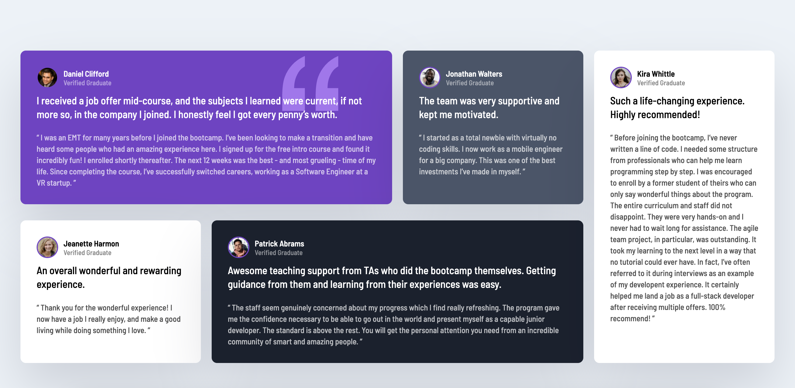

# Testimonials Grid

This is a solution to the [Testimonials Grid Section challenge from Frontend Mentor](https://www.frontendmentor.io/challenges/testimonials-grid-section-Nnw6J7Un7).  

### The challenge

- Users should be able to view the optimal layout depending on their device's screen size.

### Links

- Solution URL: [GitHub repository](https://github.com/daniele-frade/frontend-mentor/tree/main/testimonials-grid)
- Live Site URL: [https://transcendent-stroopwafel-d37e6b.netlify.app](https://transcendent-stroopwafel-d37e6b.netlify.app)

### Screenshot of the solutions

 

### Built with

- Semantic HTML5 markup
- CSS custom properties
- Grid
- Flexbox

### What I learned

- With this challenge I was able to learn and put into practice CSS Grid Layout.

### Author

- Daniele Frade - [LinkedIn](https://www.linkedin.com/in/daniele-frade/) | [Github](https://github.com/daniele-frade)
- Frontend Mentor - [@daniele-frade](https://www.frontendmentor.io/profile/daniele-frade)

